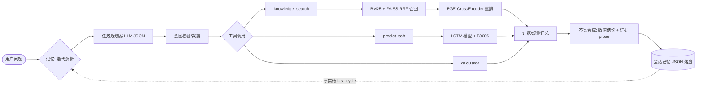

# 锂电池 SOH 预测与 RAG 智能问答 Agent

> 基于 NASA 锂电池循环数据集，把 **LSTM 时序预测**、**混合检索 RAG** 封装为一个具备
> **任务规划、工具调用、会话记忆**的最小 Agent；数值结论确定性拼装，机理解释带证据可溯源。


## 目录

- [项目简介](#项目简介)
- [系统架构](#系统架构)
- [目录结构](#目录结构)
- [环境安装](#环境安装)
- [快速开始](#快速开始)
- [检索评估](#检索评估)
- [1 分钟演示](#1-分钟演示)
- [失败案例与局限](#失败案例与局限)
- [后续优化](#后续优化)
- [技术栈](#技术栈)

## 项目简介

面向动力电池健康管理场景，项目包含两条能力线：

1. **LSTM 时序预测**：解析 NASA B0005 充放电循环数据，电流积分计算放电容量，
   用 time_step=5 的 LSTM 学习容量衰减规律，输出预测容量与 SOH。
2. **混合检索 RAG**：BM25 关键词 + FAISS 稠密向量双路召回（RRF 融合），
   BGE CrossEncoder 重排，基于锂电池知识库回答 SOH 定义、SEI 膜、析锂、BMS 等问题。

在两者之上实现了一个**最小 Agent**：LLM 输出 JSON 任务计划 → 意图校验与裁剪 →
依次调用工具（支持后一步引用前一步结果）→ 数值结论 + 证据片段综合成回答；
会话记忆负责跨轮次的指代解析（如“再循环 50 次”）。

## 系统架构



**Agent 三个核心部件**

| 部件 | 实现位置 | 说明 |
|---|---|---|
| 任务规划 | `src/agent/planner.py` | LLM 按工具 schema 输出 `{"steps":[...]}`；解析失败或工具非法时，确定性路由规则兜底 |
| 工具调用 | `src/agent/tools.py` | 注册器模式；参数支持 `{{工具名.字段}}` 模板，实现 predict → calculator 的结果链式传递 |
| 会话记忆 | `src/agent/memory.py` | 对话窗口 + 事实槽（last_cycle、battery_id），JSON 落盘，跨进程保留 |

规划在执行前还会经过 `prune_plan`：按问题意图删掉未被问到的工具（例如纯数值追问
不再触发知识库检索），避免小模型过度规划与幻觉。

## 目录结构

```
battery_project/
├── src/
│   ├── agent/                  # 最小 Agent 包
│   │   ├── config.py           # 路径、模型名、离线开关
│   │   ├── llm.py              # Qwen 加载、chat template、生成
│   │   ├── retriever.py        # BM25+FAISS 混合检索与 BGE 重排
│   │   ├── tools.py            # 3 个工具 + 注册器
│   │   ├── memory.py           # 会话记忆（窗口 + 事实槽）
│   │   ├── planner.py          # LLM 规划 + 规则兜底 + 指代解析
│   │   └── agent.py            # 规划→执行→综合 主循环
│   ├── build_index.py          # 重建 FAISS 索引（知识库改动后必跑）
│   ├── day6_agent.py           # Agent CLI（单次提问 / 交互模式）
│   ├── demo_agent.py           # 1 分钟演示脚本
│   ├── battery_processing.py   # 容量提取等可单测函数
│   ├── day1_plot.py            # 数据读取与容量曲线
│   ├── day2_lstm.py            # LSTM 训练
│   ├── day3_rag.py             # 基础向量 RAG
│   ├── day4_hybrid_rag.py      # 混合检索 RAG
│   └── day5_web_app.py         # Streamlit 双标签页应用
├── tests/
│   ├── unit/                   # 单元测试
│   └── e2e/                    # Streamlit 冒烟测试
├── eval/
│   ├── eval_retrieval.py       # 检索评估脚本
│   └── results/
│       ├── retrieval_eval.json # 逐题明细
│       └── retrieval_eval.md   # 汇总指标
├── docs/
│   ├── demo_transcript.md      # 演示实录
│   ├── resume_snippets.md      # 简历素材
│   └── 测试与CI使用说明.md
├── .github/workflows/test.yml  # CI：单元测试 + 报告
├── conftest.py / pytest.ini    # pytest 配置
├── requirements-dev.txt        # 测试依赖
├── data/
│   ├── battery_info.txt        # 知识库（随仓库提交）
│   ├── B0005.mat               # NASA 数据（gitignore）
│   ├── lstm_battery_model.h5   # LSTM 权重（gitignore）
│   ├── faiss_db/               # FAISS 索引（gitignore）
│   └── model/                  # HF 模型缓存（gitignore）
├── assets/                     # 页面截图
├── requirements.txt
└── README.md
```

## 环境安装

```bash
conda create -n battery python=3.10 -y
conda activate battery
pip install -r requirements.txt -i https://pypi.tuna.tsinghua.edu.cn/simple
```

项目默认**离线运行**（`HF_HUB_OFFLINE=1`），首次使用需在联网环境预下载模型：

```bash
pip install -U huggingface_hub
set HF_ENDPOINT=https://hf-mirror.com
huggingface-cli download Qwen/Qwen2.5-0.5B-Instruct ^
  sentence-transformers/all-MiniLM-L6-v2 BAAI/bge-reranker-base
```

> 有 GPU 或追求回答质量时，设置 `AGENT_LLM=Qwen/Qwen2.5-1.5B-Instruct` 即可切换，
> 其余代码无需改动。

## 快速开始

```bash
# 1.（可选但推荐）按当前知识库重建 FAISS 索引
python src/build_index.py

# 2. Agent 单次提问
python src/day6_agent.py "B0005电池循环到100次时容量还剩多少？SOH是多少？"

# 3. 交互模式（/reset 清空记忆，/quit 退出）
python src/day6_agent.py --session chat

# 4. 1 分钟端到端演示（自动预热并生成 docs/demo_transcript.md）
python src/demo_agent.py

# 5. Streamlit 网页（RAG 问答 + LSTM 预测双标签页）
streamlit run src/day5_web_app.py

# 6. 分阶段教程脚本
python src/day1_plot.py && python src/day2_lstm.py
python src/day3_rag.py && python src/day4_hybrid_rag.py
```

## 检索评估

**方法**：18 个标注问题（含字面表述与语义改写），gold chunk 由“关键短语必须同时出现”
在运行时自动映射，避免硬编码下标；每个方案跑 3 轮，报告 Hit@k、Recall@k、MRR
与单问平均延迟。复现：

```bash
python eval/eval_retrieval.py
```

**结果**（完整数据见 [`eval/results/retrieval_eval.md`](eval/results/retrieval_eval.md)）：

| 方案 | Hit@1 | Hit@3 | MRR | 延迟 ms |
|---|---|---|---|---|
| BM25 | 0.167 | 0.500 | 0.419 | 0.6 |
| FAISS 稠密 | 0.556 | 0.889 | 0.701 | 15.0 |
| 混合 RRF | 0.278 | 0.722 | 0.540 | 15.1 |
| 混合 + BGE 重排 | **0.889** | **1.000** | **0.944** | 188.7 |

**结论**：

1. **重排是最大增益点**：Hit@1 从 0.278 提升到 0.889，MRR 从 0.540 提升到 0.944——
   CrossEncoder 对 query-chunk 做联合编码，纠正了召回阶段的排序错误。
2. **朴素 RRF 不保证增益**：本知识库上混合 RRF 的 MRR（0.540）反而低于 FAISS 单路
  （0.701），弱检索器（BM25）通过 RRF 拉低了正确 chunk 的位置；需要调权重或动态融合。
3. **BM25 短板在中文分词**：默认 tokenizer 把连续中文整句当作单个 token，
   语义改写问题几乎失效（Hit@1 仅 0.167）。

## 1 分钟演示

演示脚本 [`src/demo_agent.py`](src/demo_agent.py) 完整呈现七个阶段：

```
问题输入 → 任务规划 → 混合检索 → BGE 重排 → 工具调用 → 生成回答 → 证据展示
```

- 启动时一次性预热全部模型（约 1–2 分钟），**预热不计入演示计时**；
- 第 1 轮三工具协同（LSTM 容量 → calculator 算 SOH → 知识库检索机理），实测约 **34 s**；
- 第 2 轮“那再循环 50 次呢？”由记忆把目标解析为第 150 次循环，实测约 **16 s**；
- 两轮正式演示总耗时约 **50 s**。

完整逐行实录见 [`docs/demo_transcript.md`](docs/demo_transcript.md)，页面截图见 `assets/`。

## 失败案例与局限

以下问题均在开发中实际出现，按“现象 → 原因 → 处理”记录：

1. **索引陈旧，混入旧文本**
   - 现象：检索候选中出现当前知识库不存在的片段（cid=-1）。
   - 原因：编辑过 `battery_info.txt` 后未重建 FAISS，索引里是旧版本 chunk。
   - 处理：提供 `build_index.py` 显式重建；后续可在构建时对知识库做 hash 校验。

2. **粗切分合并了多个话题**
   - 现象：300/30 切分把“SOH 定义 + 衰减机理 + NASA 数据集”合并为一个 chunk，
     证据无法定位到具体话题，评估也失去区分度。
   - 处理：Agent/评估链路改为按段落的话题级切分（每段一个 chunk），day1–day5
     教程脚本保留原口径作为迭代记录。

3. **BM25 未做中文分词**
   - 现象：BM25 对多数问题返回近乎相同的排序，Hit@1 仅 0.167。
   - 原因：rank-bm25 默认按 `\w+` 切词，连续中文整句成为一个 token。
   - 处理：短期以稠密检索 + 重排为主；后续接入 jieba 分词。

4. **RRF 被弱检索器拖累**
   - 现象：混合 RRF 的 MRR 0.540，低于 FAISS 单路 0.701。
   - 原因：等权 0.5/0.5 融合让 BM25 的错误排序惩罚了正确 chunk。
   - 处理：当前依赖 BGE 重排兜底（MRR 0.944）；后续改为按查询动态分配权重。

5. **小模型的词语替换与公式编造**
   - 现象：0.5B 偶尔把“锂离子”写成“碱性电池”、把“截止电压”写成“封装材料”，
     甚至在数值追问中编造 `SOH = 1/n`。
   - 处理：数值部分改为工具结果确定性拼装；`prune_plan` 对纯数值问题裁剪掉
     知识库 prose；证据强制展示，用户可即时核对。需要更高质量时切换 1.5B 或上 GPU。

6. **LSTM 为 in-sample 预测，不能外推**
   - 现象：预测曲线与实测贴合很好，但该结果是在同一段序列上得到的，指标偏乐观。
   - 原因：day2 在全量数据上训练并在同序列预测；time_step=5 本质是平滑式追踪，
     无法预测训练区间之外的循环。
   - 处理：后续按循环区间切分训练/验证集，并给出外推置信区间。

7. **知识库覆盖面有限**
   - 现象：知识库仅 5 个话题段落，价格、厂家等问题无内容可答；top3 证据中可能
     混入相邻话题（如机理问题带出 NASA 数据集片段）。
   - 处理：系统提示要求无证据时回复“知识库暂无相关信息”；扩库后需重跑评估。

## 后续优化

- 检索：BM25 接入 jieba 分词；RRF 改为按查询类型的动态权重；扩充多源文档（标准、论文、运维记录）。
- Agent：引入多轮 ReAct 反思与工具自检；记忆增加摘要压缩与向量检索（long-term memory）。
- 预测：LSTM 增加训练/验证切分与外推区间，融合 CNN-LSTM / 注意力模型并对比。
- 工程：GitHub Actions 自动跑评估并对比指标基线；Docker 镜像固定模型版本。

## 技术栈

Python 3.10 · LangChain / langchain-classic / langchain-community · FAISS · rank-bm25
· sentence-transformers（MiniLM 嵌入、BGE CrossEncoder 重排）· Transformers（Qwen2.5
本地指令模型）· TensorFlow/Keras（LSTM）· Streamlit · NumPy / SciPy / scikit-learn / Matplotlib
