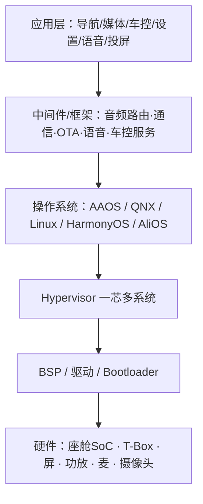
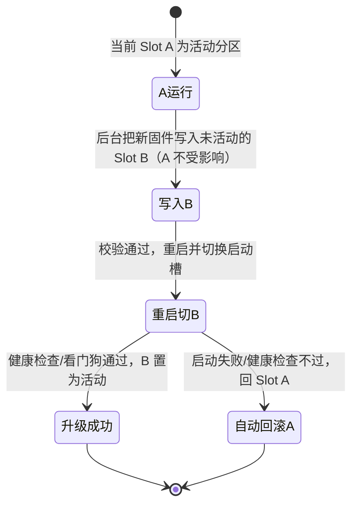

# 车机软件模块概览

> 面向座舱 / 车联网软件，讲清五大模块：车机网联、音视频、投屏（手机互联）、OTA、语音助手。先建立整体架构，再逐模块拆解「是什么 + 工作原理 + 关键技术 + 测试关注点」。

## 0. 整体架构（先有全局）

**硬件**
- **座舱域控制器（座舱 SoC）**：座舱算力中心，常见高通 SA8155P / SA8295P / SA8397、联发科、三星、芯驰 X9、龍鷹一號等。
- **T-Box**：远程通信终端（独立盒子或集成进域控），负责车内网与蜂窝外网的连接。
- 外设：仪表、中控屏、副驾屏、HUD、功放（AMP）/DSP、麦克风阵列、多路摄像头、扬声器。

**软件分层（自上而下）**



- **Hypervisor**：一颗 SoC 上虚拟出多个系统，例如仪表跑安全实时的 QNX、中控跑 Android，互不影响。
- 车内网络：CAN / CAN-FD / LIN、车载以太网（AVB/TSN）；对外：4G/5G。

---

## 1. 车机网联（Connected / Telematics）

**T-Box（Telematics Box）** 是车内网与外网之间的网关：
- 对内通过 CAN/CAN-FD/以太网接入整车网络，对外通过 4G/5G 接入运营商网络。
- 核心功能：**远程控制**（手机 App 开锁、开空调、寻车、车窗）、**远程诊断**、车辆数据/位置上报、**eCall/bCall**（事故自动紧急呼叫 / 手动故障呼叫）。

**链路**：车辆 → 基站（专用 APN）→ 车企云平台 **TSP（Telematics Service Provider）** → 用户 App。

**V2X（车用无线通信，Vehicle to Everything）**

| 类型 | 通信对象 | 典型场景 |
|---|---|---|
| V2V | 车 ↔ 车 | 前向碰撞预警、编队、盲区提醒 |
| V2I | 车 ↔ 路侧设施 RSU | 红绿灯信息、限速、路口碰撞 |
| V2N | 车 ↔ 云 | 远程信息、云端调度 |
| V2P | 车 ↔ 行人 | 行人/非机动车预警 |

- 两大技术路线：**C-V2X**（中国主导，含 LTE-V2X 与 5G NR-V2X）、**DSRC / 802.11p**（欧美早期）。
- 终端：车上 OBU、路侧 RSU。

**短距通信**：蓝牙（通话/配对/数字钥匙）、Wi-Fi（热点/投屏）、NFC（刷卡数字钥匙）、**UWB**（厘米级数字钥匙定位）。数字钥匙遵循 **CCC** 行业标准。
**安全**：PKI 数字证书、SecOC（车载通信认证）、TLS 加密、入侵检测 IDS。

---

## 2. 音视频（Audio / Video）

**音频链路**

```
音源(本地/蓝牙/在线/收音机) → 解码 → 音频路由/混音(AudioFlinger)
  → 音效(EQ/环绕/声场) → 音量管理 → DSP/功放(AMP) → 扬声器(多声道/多音区)
```

- 关键算法：**AEC 回声消除**（语音/通话时去掉喇叭声）、**ANS/ANC 降噪/主动降噪**、**AGC 自动增益**、波束成形、**多音区**（主驾/副驾/后排独立音源与独立语音）。
- 音频焦点（Audio Focus）：导航播报、来电、音乐之间的抢占与 Duck（压低背景音）。
- 收音机：AM/FM、DAB 数字广播；车载以太网用 **AVB/TSN** 保证音视频时间同步。

**视频链路**：摄像头经串行链路（GMSL / FPD-Link / MIPI CSI）→ SoC 的 ISP/解码 → 图形合成渲染 → 屏幕（MIPI DSI / eDP / LVDS）。
- 多路视频：**AVM 360° 环视**、**DMS 驾驶员监测**、**OMS 乘员监测**、电子后视镜、行车记录仪；座舱域控可支持十余路摄像头输入。
- 屏幕：仪表（通常 QNX，强调功能安全）、中控、副驾屏、后排娱乐、**HUD**（W-HUD / AR-HUD）。

---

## 3. 投屏 / 手机互联（Phone Projection）

**本质**：手机端 App 的界面经过重绘或视频编码送到车机大屏，车机再把触控、旋钮、麦克风事件回传手机；它**不是简单镜像**，而是为驾驶场景做了适配（简化界面、语音、方向盘按键）。

| 方案 | 适用手机 | 连接方式 | 说明 |
|---|---|---|---|
| **Apple CarPlay** | iPhone | USB，或无线 | 无线：**蓝牙负责配对握手，Wi-Fi 点对点负责传画面/音频**，握手后蓝牙可断开；需苹果 **MFi** 认证 |
| **Android Auto** | Android | USB / 无线 | Google 生态，国内受限 |
| **华为 HiCar** | 华为及部分安卓 | 蓝牙 + WLAN | 华为生态、设备协同 |
| **百度 CarLife** | 跨平台 | USB / Wi-Fi | 国内车型常见，兼容性广 |
| **ICCOA CarLink** | 小米/OPPO/vivo 等 | USB（AOA）/ 无线（**BLE + Wi-Fi P2P/AP**） | 智慧车联开放联盟标准，支持熄屏连接 |
| **Miracast / DLNA** | 通用 | Wi-Fi | 纯镜像或媒体投送，延迟较高、手机常亮 |

**统一连接原理**：配对、鉴权、控制信令走低功耗蓝牙（BLE）；大数据量的视频/音频走 Wi-Fi 点对点（P2P）或 AP 热点。

---

## 4. OTA（Over-The-Air，远程升级）

**分类**
- **SOTA（Software OTA）**：座舱应用、地图、UI 等软件更新，风险较低。
- **FOTA（Firmware OTA）**：BMS、动力、底盘等 ECU 固件更新，风险高，通常基于 **UDS 诊断**（编程会话、安全访问、数据传输 0x34/0x36/0x37），经 CAN 或 **DoIP**（基于以太网的诊断）刷写。
- 另有 COTA（配置升级）、DOTA（数据升级）。

**整包 vs 差分**：差分包（delta，常用 bdiff/xDelta 等）只包含变化部分，省流量；车端用差分引擎把差分包与当前版本合并还原成完整镜像。

**A/B 双分区（双 Slot / 双 Bank）—— 主流可靠方案**



- 优点：下载安装不影响用车、断电安全、**失败可原子回滚**。

**完整流程**：云端版本管理与灰度策略 → 任务下发到 T-Box/车机 → 下载（断点续传）→ **签名与完整性校验（PKI/Hash）** → 检查升级条件（电源、挡位、电量/电压、静止/非行车）→ 安装刷写 → 重启切换 → 健康验证 → 结果上报。
**安全**：加密传输、签名验签、**防回滚 anti-rollback**、刷写次数/防刷保护、动力域禁止行车中刷写。

---

## 5. 语音助手（Voice Assistant）

**完整链路**

```
麦克风阵列 → 前端信号处理(AEC回声消除·降噪·波束成形·声源定位DOA)
  → 唤醒 KWS(关键词检测，低功耗常驻，如"你好，XX")
  → ASR 语音转文字 → NLU 语义理解(意图 Intent + 槽位 Slot)
  → 技能/执行(车控·导航·媒体·问答) → NLG/TTS 语音合成播报
```

- **本地（离线）vs 云端（在线）**：本地负责唤醒与简单车控，响应快、保护隐私、无网可用；云端负责复杂理解、多轮对话与知识问答；主流为「本地 + 云端混合，本地兜底」。
- 关键体验：**多音区识别**（区分主驾/副驾/后排指令）、**免唤醒/全时语音**、**可见即可说**（直接说出屏幕上的文字）、多轮对话、**打断 barge-in**、声纹识别区分用户、方言与情感化表达。
- 硬件：MEMS 数字麦克风，常见 2/4/6 麦线性或环形阵列；厂商常宣称识别准确率 95% 以上。
- 代表：蔚来 NOMI、理想同学、小鹏小 P、华为小艺，以及科大讯飞、思必驰等方案商。

---

## 6. 各模块测试关注点（结合软件测试方法）

| 模块 | 黑盒功能/场景测试 | 专项测试 |
|---|---|---|
| 网联 | 弱网/断网重连、APN 接入、远程控车、eCall | 网络安全、远程指令时延、证书/PKI |
| 音视频 | 音频焦点与来电打断、多音区、路由切换 | AEC/降噪效果、卡顿/延迟、多路摄像头并发 |
| 投屏 | 配对/自动重连、触控回传、分辨率/多屏 | 连接延迟、USB 枚举、无线稳定性、断线恢复 |
| OTA | 差分/整包升级、版本灰度、升级条件门限 | 断电/断网、A/B 回滚、防回滚、刷写失败恢复 |
| 语音 | 唤醒率/误唤醒、多音区、多轮、打断 | 高速/开窗/噪声场景、口音方言、离线兜底 |
| 通用 | 启动时间、长时间老化（内存泄漏） | 车规温域/振动、HIL 台架、CANoe 仿真、诊断一致性 |

---

## 7. 术语速查表

| 缩写 | 全称 / 含义 |
|---|---|
| T-Box | Telematics Box，远程通信终端 |
| TSP | Telematics Service Provider，车联网服务平台 |
| OBU / RSU | 车载单元 / 路侧单元 |
| C-V2X | 蜂窝车联网（LTE-V2X / NR-V2X） |
| eCall / bCall | 紧急呼叫 / 故障呼叫 |
| AAOS | Android Automotive OS，安卓车载操作系统 |
| AVB / TSN | 音视频桥接 / 时间敏感网络 |
| AEC / ANC / AGC | 回声消除 / 主动降噪 / 自动增益 |
| DOA / KWS | 声源定位 / 关键词唤醒 |
| ASR / NLU / NLG / TTS | 语音识别 / 语义理解 / 语言生成 / 语音合成 |
| SOTA / FOTA | 软件升级 / 固件升级 |
| UDS / DoIP | 统一诊断服务 / 基于以太网的诊断 |
| A/B（双 Slot） | 双分区无缝升级与回滚机制 |
| MFi / AOA | 苹果外设认证 / 安卓开放配件协议 |
| BLE / UWB / NFC | 低功耗蓝牙 / 超宽带 / 近场通信 |
| CCC / SecOC / PKI | 数字钥匙联盟 / 车载通信安全 / 公钥基础设施 |
| AVM / DMS / OMS / HUD | 环视 / 驾驶员监测 / 乘员监测 / 抬头显示 |

## 参考资料
- 无线 CarPlay 连接原理（蓝牙握手 + Wi-Fi 传输）：https://cn.carlinkit.com/faq_detail/7.html
- ICCOA CarLink 连接方式（USB-AOA / BLE+Wi-Fi P2P）：https://cdn.iccoa.cn/news/56.html
- A/B 双分区升级与回滚：https://androidmobiles.org/aaos-a-b-ota-deep-dive-unpacking-the-boot_control-hal-update-engine-mechanics/
- 车载 FOTA 刷写流程与验证：https://blog.csdn.net/weixin_43586667/article/details/126840617
- 座舱域控与语音（唤醒/双麦降噪/声源定位）：https://en.smartsh.com/index/Cockpit/info.html
