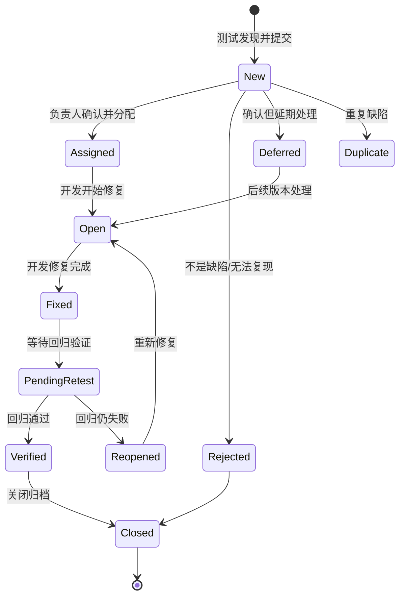

# 软件测试复习笔记

> 关键词：黑盒 / 白盒、等价类划分、边界值分析、缺陷生命周期。最后给出这些方法在电池数据处理项目中的落地映射。

## 1. 黑盒测试 vs 白盒测试

| 维度 | 黑盒测试 | 白盒测试 |
|---|---|---|
| 别名 | 功能测试、不透明盒、基于规格的测试 | 结构测试、透明盒、玻璃盒、基于代码的测试 |
| 是否看内部实现 | 不看，只关心「输入 → 输出」 | 看代码结构、分支、路径 |
| 关注点 | 功能是否正确、界面、接口、性能、异常提示 | 语句/分支/路径是否被执行、逻辑是否正确 |
| 常用方法 | 等价类划分、边界值分析、因果图、判定表、场景法、正交试验、错误推测 | 语句覆盖、判定覆盖、条件覆盖、判定-条件覆盖、条件组合覆盖、路径覆盖、基本路径法、循环测试 |
| 主要阶段 | 系统测试、验收测试（也用于确认测试） | 单元测试、集成测试（部分） |
| 执行者 | 测试人员 | 开发人员（更了解代码） |
| 优点 | 贴近用户、无需懂代码、能发现需求遗漏 | 能定位到具体代码、覆盖隐藏逻辑 |
| 缺点 | 难以覆盖全部代码路径，不知道内部为何错 | 工作量大、无法发现「需求缺失/功能没做」 |

- **灰盒测试**：介于两者之间，既看输出也关注部分内部结构（如接口 + 数据库），常用于**集成测试**。
- **白盒逻辑覆盖由弱到强**：语句覆盖 < 判定覆盖 < 条件覆盖 < 判定-条件覆盖 < 条件组合覆盖 < 路径覆盖。
  - 语句覆盖：每条语句至少执行一次（最弱）。
  - 判定覆盖（分支覆盖）：每个判定的「真/假」都取到。
  - 条件覆盖：每个判定中的每个条件取到各种可能值。
  - 路径覆盖：覆盖程序中所有可能的执行路径（最强，但路径多时不可行）。
- **静态测试 vs 动态测试**：静态不实际运行程序（代码走查、评审、静态扫描）；动态需要运行（功能/性能测试）。

## 2. 等价类划分（Equivalence Partitioning）

**核心思想**：把输入域划分为若干个等价类，认为同一类中任意一个输入揭露缺陷的能力相同，因此每类只取一个代表值，用少量用例代替穷举。

- **有效等价类**：符合需求规格、合理的输入集合（验证「做对了」）。
- **无效等价类**：不符合规格的输入集合（验证「异常处理」，如非法值、空值、越界值）。

**设计步骤**：
1. 按输入条件划分有效、无效等价类并编号；
2. 设计用例：一个用例尽量覆盖**多个尚未覆盖的有效等价类**；
3. 对无效等价类，**一个用例只覆盖一个无效等价类**（避免多个错误相互掩盖，定位更清晰）。

**例子：滑动窗口参数 `time_step`（要求为正整数，且小于序列长度 N）**

| 等价类 | 取值范围 | 代表值 |
|---|---|---|
| 有效 | 1 ≤ step ≤ N−1 的整数 | 5 |
| 无效：零 | step = 0 | 0 |
| 无效：负数 | step < 0 | −1 |
| 无效：小数 | step 为非整数 | 2.5 |
| 无效：类型错 | 非数值 / 布尔 | True、"a" |
| 无效：越界 | step ≥ N | N、N+1 |

## 3. 边界值分析（Boundary Value Analysis, BVA）

**核心思想**：大量缺陷集中在输入域的「边界」而非中间，因此在等价类边界及其两侧取点。它是等价类划分的补充。

- **基本边界值（闭区间 [min, max]）**：`min`、`min+`、`nom（正常值）`、`max−`、`max`。
- **健壮性边界值**：再加 `min−`、`max+`（越界值），考察程序的容错与提示。
- **次边界 / 内部边界**：不是显式输入边界，而是实现中的临界值，如 2 的幂、ASCII 的 0/255、闰年 2 月 29 日、缓冲区长度、分页大小。

**例子：`build_windows(series, time_step)` 中序列长度 N 与窗口 step=5**

| N（序列长度） | 关系 | 期望结果 |
|---|---|---|
| 6（= step+1） | 恰好能构造 1 个样本 | 返回 1 组 X/y |
| 5（= step） | 无法构造 | 抛 ValueError |
| 4（= step−1） | 无法构造 | 抛 ValueError |
| 很大（如 1000） | 正常 | 返回 N−step 组样本 |

容量积分 `reconstruct_capacity` 的边界：**至少 2 个采样点**（1 个点无法求 dt）、时间必须单调不减。

> 经验：等价类负责「面」上的代表，边界值负责「点」上的临界，二者通常一起使用。

## 4. 缺陷生命周期（Defect Life Cycle / Bug Life Cycle）

**主要状态说明**

| 状态 | 含义 |
|---|---|
| New（新建） | 刚被发现、提交，尚未确认 |
| Assigned（已分配） | 确认是缺陷，指派给开发 |
| Open（打开/处理中） | 开发正在修复 |
| Fixed（已修复） | 开发认为已修复，待测试验证 |
| Pending Retest（待复测） | 等待测试回归 |
| Reopened（重新打开） | 回归未通过，退回开发 |
| Verified（已验证） | 回归通过，确认修复 |
| Closed（已关闭） | 缺陷彻底解决并归档 |
| Rejected（拒绝） | 非缺陷、设计如此、无法复现 |
| Duplicate（重复） | 与已有缺陷重复 |
| Deferred（延期） | 确认是缺陷但推迟到后续版本 |

**严重等级（Severity） vs 优先级（Priority）**

- Severity：缺陷对系统的**破坏程度**，常见 `Blocker（阻断） > Critical（严重） > Major（一般） > Minor（轻微） > Trivial（琐碎）`。
- Priority：修复的**紧迫/先后顺序**，常见 `High / Medium / Low`。
- 二者不等价：例如首页 Logo 错别字，Severity 很低，但发布会前 Priority 可能是 High；某个深层崩溃 Severity 高，但该功能暂不上线，Priority 可较低。

**缺陷报告要素**：标题（一句话概括）、测试环境（版本/系统/浏览器）、前置条件、复现步骤、预期结果、实际结果、严重等级、附件（截图 / 日志 / 录屏）、报告人与指派人。

## 5. 方法在本项目中的落地映射

| 测试点 | 使用的方法 | 对应用例 |
|---|---|---|
| 恒流/变采样容量计算 | 白盒（验证积分公式）+ 等价类 | `test_reconstruct_capacity_values` |
| 长度不一致、点数不足、时间倒序、充电电流 | 无效等价类 | `test_reconstruct_invalid_inputs` |
| 缺失值：内部 / 端点 / 全缺 | 等价类划分 | `test_fill_linear_interior_and_edges`、`test_fill_methods_and_failures` |
| 窗口样本数、形状、内容 | 白盒 + 正常等价类 | `test_build_windows_count_shape_content` |
| N = step+1 / step / step−1 | 边界值分析 | `test_build_windows_boundary` |
| step = 0、负数、小数、布尔 | 无效等价类 | `test_build_windows_invalid_step` |
| None、字符串、二维、空序列 | 无效等价类 / 健壮性 | `test_non_numeric_and_shape_inputs` |
| 真实 NASA B0005 数据 | 场景 / 集成测试 | `test_b0005_discharge_capacities` |

## 6. 自测速记

1. 只看输入输出、不看代码 → **黑盒**；针对代码逻辑路径 → **白盒**。
2. 无效等价类为什么一个用例只覆盖一个？→ 防止多个错误互相掩盖、便于定位。
3. 边界值取哪些点？→ min、min+、nom、max−、max，健壮性再加 min−、max+。
4. 缺陷生命周期主线：New → Assigned → Open → Fixed → Pending Retest → Verified → Closed；复测失败回到 Reopened。
5. Severity 说「有多严重」，Priority 说「先修哪个」。
